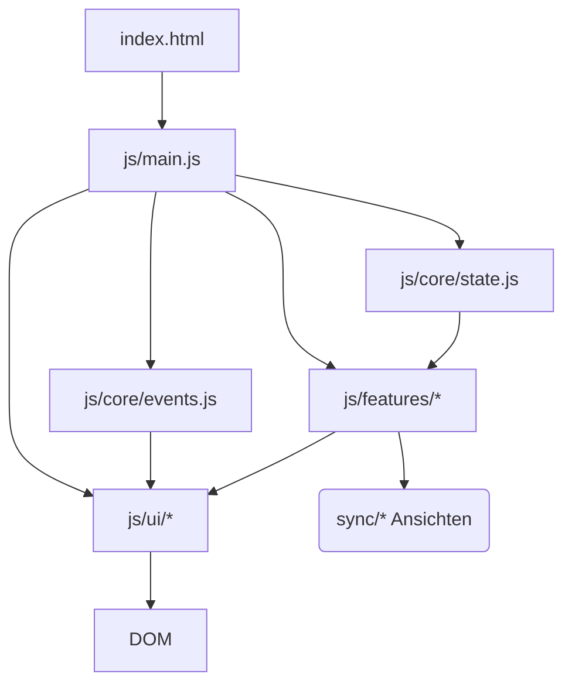
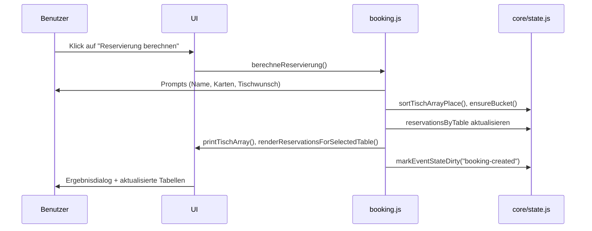

# Tischreservierung des Sandersdorfer Karnevalsverein e.V.

Eine vollständig clientseitige Applikation zur Verwaltung von Tischreservierungen, Saalplänen und Zusatzansichten für Vereinsveranstaltungen. Das Projekt bündelt die komplette Abwicklung von der Veranstaltungsanlage über Sitzplatzvergabe, Synchronisation mit Zusatz-Displays bis zur Rechnungsbereitstellung.

## Inhaltsverzeichnis
- [Funktionaler Überblick](#funktionaler-überblick)
- [Schnellstart](#schnellstart)
- [Projektstruktur](#projektstruktur)
- [Architektur im Überblick](#architektur-im-überblick)
- [State- und Event-Management](#state--und-event-management)
- [Reservierungs- und Sitzplatzlogik](#reservierungs--und-sitzplatzlogik)
- [Synchronisation & Zusatzansichten](#synchronisation--zusatzansichten)
- [Datenexport & -import](#datenexport---import)
- [UI-Komponenten](#ui-komponenten)
- [How-To & Anwenderdokumentation](#how-to--anwenderdokumentation)
- [Entwicklung & Tests](#entwicklung--tests)
- [Troubleshooting & Tipps](#troubleshooting--tipps)

## Funktionaler Überblick
- **Mehrere Veranstaltungen parallel** dank Tab-System und Start-Overlay (`js/ui/eventManagement.js`).
- **Intelligente Sitzplatzverteilung** mit Tischwunsch-Präferenz (`js/features/booking.js`).
- **Vollständige Datenhaltung im Browser**: alle Reservierungen, Preise und Anzeigenamen werden im zentralen State (`js/core/state.js`) verwaltet.
- **Live-Synchronisation** zwischen unterschiedlichen Tabs für internen/externe Saalpläne und Kundendisplay (`js/features/*Sync.js`).
- **Komfortfunktionen** wie JSON-Import/-Export, Cache-Handling und Rechnungsgenerierung.

## Schnellstart
1. Repository klonen oder herunterladen.
2. Projektordner öffnen und `index.html` in einem modernen Browser laden.
3. Optional: einen lokalen Webserver starten, um das automatische Laden von Assets zu optimieren, z. B.:
   ```bash
   npx serve .
   ```
4. Dem Start-Overlay folgen und eine neue Veranstaltung anlegen oder eine vorhandene JSON importieren.

> **Hinweis:** Die Anwendung benötigt keine Build-Chain oder Backend. Alle Daten werden in `localStorage`, `BroadcastChannel` und im Arbeitsspeicher des Browsers verwaltet.

## Projektstruktur
```text
├── css/                 # Zentrales Stylesheet für App und Komponenten
├── img/                 # Logos & Favicons
├── js/
│   ├── core/            # State- und Event-Management, globale Utilities
│   ├── events/          # DOM-Ereignis-Handler und Delegation
│   ├── features/        # Fachlogik (Booking, Import/Export, Sync, Rechnungen …)
│   ├── ui/              # Präsentationslogik und UI-spezifische Controller
│   └── main.js          # Einstiegspunkt / Bootstrapping
├── sync/                # Externe und interne Zusatzansichten
├── how-to.html          # Ausführliche Anwender-Anleitung (neu)
├── index.html           # Hauptoberfläche
└── invoice.html         # Rechnungsvorlage
```

## Architektur im Überblick
Die Anwendung ist modular organisiert. Fachliche Logik und UI-Rendering sind voneinander getrennt, während `main.js` alle Module initialisiert und miteinander verknüpft.



- **State-Layer (`js/core/state.js`)**: Enthält den persistenten Zustand der aktiven Veranstaltung (Tische, Reservierungen, Preise, Anzeigenamen). Liefert Listener-Mechanismen für UI-Updates.
- **Event-Layer (`js/core/events.js`)**: Organisiert die Liste der Veranstaltungen, sorgt für Dateinamen-Konventionen und orchestriert den Wechsel zwischen Events.
- **UI-Layer (`js/ui/…`)**: Verantwortlich für Rendering, DOM-Updates und Interaktion (z. B. Tab-Rendering, Settings-Panel, Tabellensteuerung).
- **Features (`js/features/…`)**: Umsetzen fachliche Aufgaben wie Buchungserfassung, Import/Export, Modale, Synchronisations-Logik und Rechnungen.

## State- und Event-Management
Der zentrale State ist in `js/core/state.js` definiert. Wichtige Bestandteile:

- `createEmptyEventState()` erzeugt eine konsistente Ausgangsbasis inklusive Standardtischen (`DEFAULT_TABLES`).
- Getter/Setter (`getCardPriceValue`, `setCardPriceValue`, `setSeatsByTableNumber`, …) kapseln Zugriffe auf den Zustand.
- Listener (`onCardPriceChange`, `onEventStateDirty`) sorgen dafür, dass UI und Synchronisation unmittelbar auf Änderungen reagieren.
- `markEventStateDirty()` markiert Aktualisierungen, damit Exporte und Sync-Kanäle erkennen, wann Daten neu geladen werden müssen.

Die Verwaltung mehrerer Veranstaltungen erfolgt über `js/core/events.js`:
- `createEvent()` legt eine neue Veranstaltung mit eigenem State an.
- `setActiveEvent()` lädt den ausgewählten Event-State via `loadEventState()`.
- `buildEventName()` und `parseEventName()` garantieren konsistente Dateinamen nach dem Muster `YYYY-MM-DD-Typ`.
- `setupEventCacheAutoSave()` und verwandte Funktionen (aus `js/features/cacheStorage.js`) spiegeln Änderungen zyklisch in den Browser-Cache.

## Reservierungs- und Sitzplatzlogik
Die Buchungslogik (`js/features/booking.js`) priorisiert Tischwünsche und verteilt Restplätze intelligent:



- Tischwünsche werden bevorzugt bedient; andernfalls werden Karten passend verteilt (`reservierteKarten`).
- Jede Reservierung erhält eine eindeutige `bookingId` und `id` (`uid()`), was Bearbeitung und Synchronisation vereinfacht.
- Split-Informationen (`buildSplitInfoText`) helfen Zusatzansichten dabei, Mischplätze nachvollziehbar darzustellen.
- Die Tabelle im Hauptbereich wird komplett aus dem State gerendert (`js/ui/tableView.js`). Event-Delegation (`js/events/actions.js`) kümmert sich um Buttons für Bearbeiten, Notizen, Verschieben und Löschen.

## Synchronisation & Zusatzansichten
Drei spezialisierte Module sorgen für Live-Daten in Zusatz-Tabs:
- `internalPlanSync.js` (internes Team-Display) – färbt Tische nach Auslastung, nutzt `BroadcastChannel` plus `localStorage` als Fallback.
- `externalPlanSync.js` (öffentliche Ansicht) – stellt freie Plätze reduziert dar.
- `customerDisplaySync.js` (Kundendisplay) – zeigt Fortschritte im Verkaufsprozess, reagiert auf `customerFlow:*`-Events.

Alle Module folgen einem ähnlichen Muster:
1. Initialzustand über `setup*Sync()` herstellen (z. B. `setupInternalPlanSync()` in `main.js`).
2. Änderungen im State erkennen und Nachrichtenpakete mit Marker (`__skvInternalPlan`, `__skvExternalPlan`, …) senden.
3. Tabs über `open*Tab()` öffnen – die Buttons befinden sich im Hauptfenster.
4. Nachrichten deduplizieren (`seenMessageIds`) und als JSON an Zielansichten durchreichen.

## Datenexport & -import
`js/features/importExport.js` enthält die JSON-Schnittstellen:
- **Sitzplätze**: `exportSeatsJSON()` und `importSeatsJSON()` sichern die Tischkonfiguration (`tisch`-Array).
- **Reservierungen**: `exportReservationsJSON()`/`importReservationsJSON()` verwenden den vollständigen Reservierungsstate inklusive Meta-Infos (`cardPriceValue`, `externalEventName`, `reservationsByTable`).
- Dateinamensvorschläge stammen aus `core/events.js` (`lastReservationsFilename`).
- Beim Import werden Eingabedaten validiert und in den aktiven Event-State geschrieben; anschließend sorgt `markEventStateDirty()` für UI-Refresh.

## UI-Komponenten
- **Settings-Panel (`js/ui/settingsPanel.js`)**: Steuert Öffnen/Schließen, Escape-Key-Unterstützung, Fokusmanagement sowie die Kartenpreis-Logik. Seit diesem Update enthält der Header einen Hilfebutton, der direkt zur How-To-Seite führt.
- **Event-Tabs (`js/ui/eventManagement.js`)**: Rendern Tabs doppelt (Header + Panel), verwalten Start-Overlay, Event-Namen-Dialog und Cache-Aktionen.
- **TableView & TableSelect (`js/ui/tableView.js`, `js/ui/tableSelect.js`)**: Generieren Tischliste, Dropdown und Reservierungstabelle. TableView sorgt außerdem für Tastaturzugänglichkeit.
- **Cart-Header (`js/ui/cartHeader.js`)** und **Feature-spezifische Modale** (`js/features/modalMoveSwap.js`, `js/features/cartModal.js`) ergänzen Workflows rund um den Verkauf.

## How-To & Anwenderdokumentation
- Die Datei [`how-to.html`](how-to.html) wurde neu hinzugefügt und ist über das Fragezeichen im Einstellungsmenü erreichbar (`target="_blank"`).
- Sie beschreibt alle Arbeitsabläufe – von der Veranstaltungsanlage bis zu Synchronisation, Rechnungen und Fehlersuche – und dient als zentrale Nutzerhilfe.

## Entwicklung & Tests
- Die Anwendung nutzt ausschließlich Vanilla JavaScript, daher ist kein Build- oder Test-Setup vorgegeben.
- Für lokale Entwicklung empfiehlt sich ein Live-Reload-Server (z. B. VS Code Live Server), um `BroadcastChannel`-Funktionalität in mehreren Tabs zu testen.
- Statische Analyse lässt sich mit Tools wie `eslint` ergänzen. Beispiel-Konfigurationen sind nicht enthalten, können aber problemlos nachgerüstet werden.
- Browserkompatibilität: getestet in aktuellen Chromium- und Firefox-Versionen. Safari unterstützt `BroadcastChannel` ab Version 15; bei älteren Versionen greift der LocalStorage-Fallback.

## Troubleshooting & Tipps
- **Sync-Probleme**: Tabs neu laden, damit der BroadcastChannel erneut verbindet; bei Bedarf LocalStorage löschen (`Veranstaltung aus Cache entfernen`).
- **Fehlerhafte Importe**: JSON-Dateien auf korrekte Struktur prüfen (`reservationsByTable`, `tisch`).
- **Sicherungen**: Nach jedem Einsatz Sitzplätze und Reservierungen exportieren; Dateien in Versionierung oder Cloud-Ordner ablegen.
- **Barrierefreiheit**: Prüfe regelmäßig die Tastaturnavigation und Screenreader-Ausgaben, insbesondere nach UI-Anpassungen.

---
Für Rückfragen oder Erweiterungen bitte das Entwicklerteam kontaktieren. Änderungen am How-To sollten sowohl in `how-to.html` als auch in dieser README vermerkt werden, damit technische und fachliche Dokumentation synchron bleiben.
