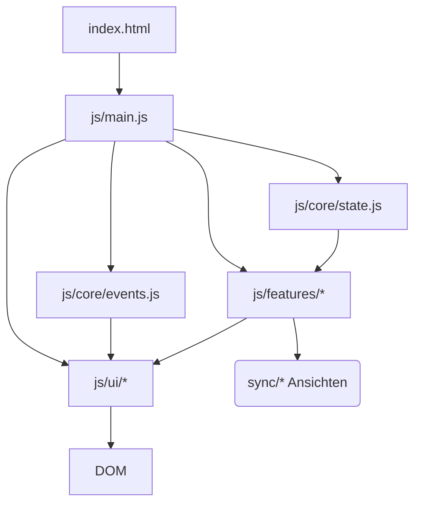
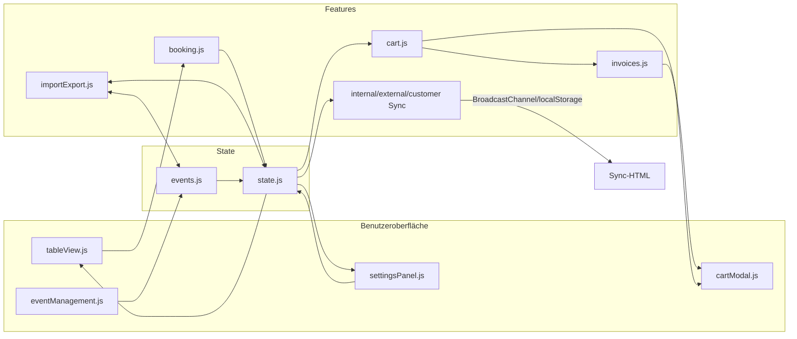
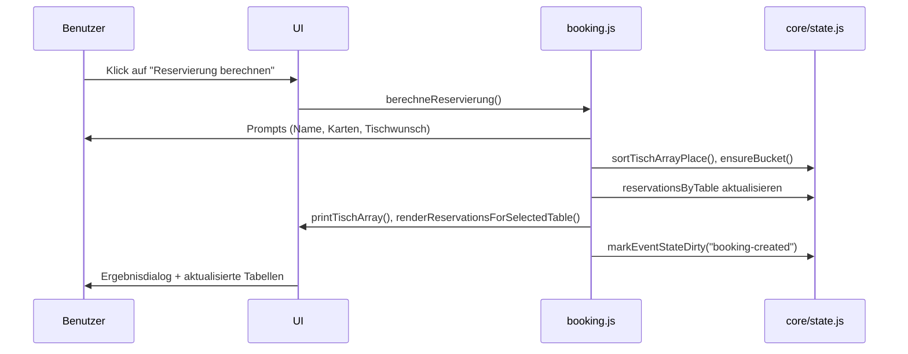
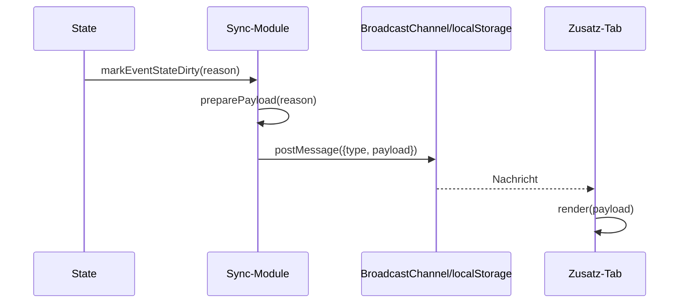

# Tischreservierung des Sandersdorfer Karnevalsverein e.V.

Eine vollständig clientseitige Applikation zur Verwaltung von Tischreservierungen, Saalplänen und Zusatzansichten für Vereinsveranstaltungen. Das Projekt bündelt die komplette Abwicklung von der Veranstaltungsanlage über Sitzplatzvergabe, Synchronisation mit Zusatz-Displays bis zur Rechnungsbereitstellung.

## Inhaltsverzeichnis
- [Funktionaler Überblick](#funktionaler-überblick)
- [Schnellstart](#schnellstart)
- [Projektstruktur](#projektstruktur)
- [Architektur im Überblick](#architektur-im-überblick)
- [State- und Event-Management](#state--und-event-management)
- [Reservierungs- und Sitzplatzlogik](#reservierungs--und-sitzplatzlogik)
- [Synchronisation & Zusatzansichten](#synchronisation--zusatzansichten)
- [Datenexport & -import](#datenexport---import)
- [UI-Komponenten](#ui-komponenten)
- [How-To & Anwenderdokumentation](#how-to--anwenderdokumentation)
- [Entwicklung & Tests](#entwicklung--tests)
- [Troubleshooting & Tipps](#troubleshooting--tipps)

## Funktionaler Überblick
- **Mehrere Veranstaltungen parallel** dank Tab-System, Start-Overlay und Cache-Anbindung (`js/ui/eventManagement.js`).
- **Intelligente Sitzplatzverteilung** mit Tischwunsch-Präferenz sowie Restplatzlogik (`js/features/booking.js`).
- **Vollständige Datenhaltung im Browser**: alle Reservierungen, Preise, Rechnungen und Anzeigenamen liegen im zentralen State (`js/core/state.js`).
- **Live-Synchronisation** zwischen Tabs für interne/externe Saalpläne und Kundendisplay (`js/features/*Sync.js`).
- **Komfortfunktionen** wie JSON-Import/-Export, Cache-Handling, Warenkorb-gestützter Verkauf und Rechnungsgenerierung (`js/features/cart*.js`, `js/features/invoices.js`).

## Technische Eckdaten
- **Technologien:** Spring Boot 3 (Java 17) zur Bereitstellung der statischen Frontend-Ressourcen sowie Vanilla JavaScript (ES Modules), HTML5 und CSS3 im Browser.
- **Persistenz:** `localStorage` für Caches, `BroadcastChannel` für Live-Sync, `Blob`-Downloads für Exporte.
- **Browser-Support:** Aktuelle Chromium-/Firefox-Versionen; Safari ≥ 15 empfohlen (Fallback auf `localStorage`).
- **Barrierefreiheit:** Fokus-Management im Einstellungs-Panel, Tastatursteuerung für Tische/Modale, WAI-ARIA-Rollen für Dialoge.
- **Deployment:** Auslieferung als ausführbare Spring-Boot-JAR möglich (z. B. auf einem beliebigen Server oder lokal via `java -jar`).
- **Komfortfunktionen (Server):** Automatisches Öffnen des Standardbrowsers und Auslieferung der Default-Eventdaten über `/api/event-state`.

## Schnellstart
1. Repository klonen oder herunterladen.
2. Projektordner öffnen und die Abhängigkeiten mit Maven auflösen sowie die Anwendung starten:
   ```bash
   mvn spring-boot:run
   ```
   Alternativ lässt sich eine ausführbare JAR erzeugen:
   ```bash
   mvn clean package
   java -jar target/tischreservierungskv-0.0.1-SNAPSHOT.jar
   ```
3. Der Server öffnet nach dem Start automatisch den Standardbrowser (sofern das Betriebssystem dies zulässt). Sollte dies nicht möglich sein, rufen Sie `http://localhost:8080` manuell auf.
4. Dem Start-Overlay folgen und eine neue Veranstaltung anlegen oder eine vorhandene JSON importieren.

> **Hinweis:** Die Business-Logik verbleibt weitgehend im Browser. Der Spring-Boot-Server liefert die statischen Ressourcen aus und stellt die Standard-Tischkonfiguration via JSON-Endpunkt bereit.

## Projektstruktur
```text
├── pom.xml              # Maven-Konfiguration für die Spring-Boot-Anwendung
├── src/
│   ├── main/java/com/example/tischreservierungskv/
│   │   ├── BrowserLauncher.java                 # Öffnet automatisch den Browser nach Serverstart
│   │   ├── TischreservierungSkvApplication.java  # Spring-Boot-Einstiegspunkt
│   │   └── state/
│   │       ├── EventStateController.java        # REST-API für initiale Eventdaten
│   │       ├── EventStateService.java           # Serverseitige Verwaltung der Standardtabellen
│   │       └── dto/
│   │           ├── EventStateResponse.java
│   │           └── TableDefinition.java
│   └── main/resources/static/
│       ├── css/          # Zentrales Stylesheet für App und Komponenten
│       ├── img/          # Logos & Favicons
│       ├── js/
│       │   ├── core/     # State- und Event-Management, globale Utilities
│       │   ├── events/   # DOM-Ereignis-Handler und Delegation
│       │   ├── features/ # Fachlogik (Booking, Import/Export, Sync, Rechnungen …)
│       │   ├── ui/       # Präsentationslogik und UI-spezifische Controller
│       │   └── main.js   # Einstiegspunkt / Bootstrapping
│       ├── sync/         # Externe und interne Zusatzansichten
│       ├── how-to.html   # Ausführliche Anwender-Anleitung (neu)
│       ├── index.html    # Hauptoberfläche
│       └── invoice.html  # Rechnungsvorlage
```

## Architektur im Überblick
Die Anwendung ist modular organisiert. Fachliche Logik und UI-Rendering sind voneinander getrennt, während `main.js` alle Module initialisiert und miteinander verknüpft.



- **State-Layer (`js/core/state.js`)**: Enthält den persistenten Zustand der aktiven Veranstaltung (Tische, Reservierungen, Preise, Anzeigenamen). Liefert Listener-Mechanismen für UI-Updates.
- **Event-Layer (`js/core/events.js`)**: Organisiert die Liste der Veranstaltungen, sorgt für Dateinamen-Konventionen und orchestriert den Wechsel zwischen Events.
- **UI-Layer (`js/ui/…`)**: Verantwortlich für Rendering, DOM-Updates und Interaktion (z. B. Tab-Rendering, Settings-Panel, Tabellensteuerung).
- **Features (`js/features/…`)**: Umsetzen fachliche Aufgaben wie Buchungserfassung, Import/Export, Modale, Synchronisations-Logik und Rechnungen.

### Datenfluss zwischen Kernmodulen



## State- und Event-Management
Der zentrale State ist in `js/core/state.js` definiert. Wichtige Bestandteile:

- `createEmptyEventState()` erzeugt eine konsistente Ausgangsbasis; die tatsächlichen Standardtische liefert nun der Spring-Boot-Endpunkt `/api/event-state`.
- Getter/Setter (`getCardPriceValue`, `setCardPriceValue`, `setSeatsByTableNumber`, …) kapseln Zugriffe auf den Zustand.
- Listener (`onCardPriceChange`, `onEventStateDirty`) sorgen dafür, dass UI und Synchronisation unmittelbar auf Änderungen reagieren.
- `markEventStateDirty()` markiert Aktualisierungen, damit Exporte und Sync-Kanäle erkennen, wann Daten neu geladen werden müssen.

Die Verwaltung mehrerer Veranstaltungen erfolgt über `js/core/events.js`:
- `createEvent()` legt eine neue Veranstaltung mit eigenem State an.
- `setActiveEvent()` lädt den ausgewählten Event-State via `loadEventState()`.
- `buildEventName()` und `parseEventName()` garantieren konsistente Dateinamen nach dem Muster `YYYY-MM-DD-Typ`.
- `setupEventCacheAutoSave()` und verwandte Funktionen (aus `js/features/cacheStorage.js`) spiegeln Änderungen zyklisch in den Browser-Cache.

### State-Struktur im Detail

```jsonc
{
  "tisch": [[1, 18, "middle", null], …],            // Tischnummer, freie Plätze, Position, Gang
  "reservationsByTable": {
    "1": [{
      "id": "uuid",
      "bookingId": 17,
      "name": "Max Mustermann",
      "cards": 4,
      "notes": "Tischwunsch: Tisch 1",
      "sold": false,
      "inCart": false,
      "ts": "2024-02-11T18:23:41.232Z"
    }]
  },
  "cardPriceValue": 19.5,
  "externalEventName": "Fasching",
  "invoices": [{ "invoiceNumber": "SKV-2024-001", … }],
  "dirty": { "booking-created": true, … }
}
```

- **Dirty-Flags** informieren Sync-Module und Auto-Speicher, welche Bereiche aktualisiert wurden (`markEventStateDirty(reason)`).
- **Helper** wie `tableLabel()` und `buildSplitInfoText()` liefern UI-kompatible Texte für Modale und Zusatzansichten.

## Reservierungs- und Sitzplatzlogik
Die Buchungslogik (`js/features/booking.js`) priorisiert Tischwünsche und verteilt Restplätze intelligent:



- Tischwünsche werden bevorzugt bedient; andernfalls werden Karten passend verteilt (`reservierteKarten`).
- Jede Reservierung erhält eine eindeutige `bookingId` und `id` (`uid()`), was Bearbeitung und Synchronisation vereinfacht.
- Split-Informationen (`buildSplitInfoText`) helfen Zusatzansichten dabei, Mischplätze nachvollziehbar darzustellen.
- Die Tabelle im Hauptbereich wird komplett aus dem State gerendert (`js/ui/tableView.js`). Event-Delegation (`js/events/actions.js`) kümmert sich um Buttons für Bearbeiten, Notizen, Verschieben und Löschen.

### Sitzplatzmanagement über das Modal
- Der Button **„Sitzplatzanzahl ändern“** öffnet das Modal aus `js/features/tablesCrud.js`.
- Jede Zeile erlaubt die Pflege von Kapazität, Position („Links/Mitte/Rechts/Stehend“) und angrenzendem Gang (für Saalpläne).
- Innerhalb des Modals stehen **„Tisch hinzufügen“** und **„Tisch entfernen“** zur Verfügung. Diese gleichen Reservierungen ab, warnen bei belegten Tischen und sortieren Nummern automatisch (`sortTischArrayNr`).
- Beim Speichern werden neue Tischnummern angelegt, gelöschte Tische inkl. Reservierungen entfernt und alle Views neu gerendert (`printTischArray`, `renderReservationsForSelectedTable`).

## Synchronisation & Zusatzansichten
Vier spezialisierte Module sorgen für Live-Daten in Zusatz-Tabs:
- `internalPlanSync.js` (internes Team-Display) – farbkodierte Auslastung, Reservierungsdetails und Split-Hinweise.
- `externalPlanSync.js` (öffentliche Ansicht) – reduzierte Darstellung freier Plätze für Besucher:innen.
- `customerDisplaySync.js` (Kundendisplay) – Fortschrittsanzeige inkl. QR-Code für Rechnungsdownload, reagiert auf `customerFlow:*`-Events.
- `sync/baseSync.js` (Hilfsfunktionen) – kapselt Broadcast-/Storage-Transport, Deduplizierung (`seenMessageIds`) und Heartbeats.

Ablauf (schematisch):



- Buttons wie **„Internen/Externen Saalplan öffnen“** und **„Kundendisplay öffnen“** initialisieren die Ziel-HTML (`sync/*.html`) und registrieren Listener.
- Sollte `BroadcastChannel` fehlen, greifen Polling und `localStorage`-Mirroring automatisch (`startStorageFallback()`).
- `signalNextCustomer()` setzt das Kundendisplay nach Abschluss eines Verkaufs zurück.

## Datenexport & -import
`js/features/importExport.js` enthält die JSON-Schnittstellen:
- **Sitzplätze**: `exportSeatsJSON()` und `importSeatsJSON()` sichern die Tischkonfiguration (`tisch`-Array inkl. Position/Gang).
- **Reservierungen**: `exportReservationsJSON()`/`importReservationsJSON()` verarbeiten den kompletten Reservierungsstate inklusive Meta-Infos (`cardPriceValue`, `externalEventName`, Rechnungsstände).
- **Validierung:** Eingehende JSON werden strukturell geprüft (`validateReservationsPayload`). Ungültige Daten lösen einen Hinweisdialog aus und werden verworfen.
- **Dateinamensvorschläge:** `core/events.js` (`buildEventName`, `parseReservationsFilename`) stellt konsistente Dateinamen sicher (`YYYY-MM-DD_<Typ>.json`).
- **Speichersicherheit:** Nach jedem Import/Export setzt `markEventStateDirty()` Sync-Trigger und aktualisiert Cache-Snapshots.

### Rechnungs-Downloads
- `downloadInvoicesZip()` bündelt erzeugte PDFs in einer ZIP-Datei (mittels `JSZip`-Fallback). Enthält Dateinamen `SKV-<Event>-<InvoiceNo>.pdf`.
- Einzelrechnungen stehen nach jedem Verkauf im Abschlussdialog (`post-sale-modal`) zur Verfügung. Ein QR-Code-Link wird parallel über das Kundendisplay verteilt.

## UI-Komponenten
- **Settings-Panel (`js/ui/settingsPanel.js`)**: Steuert Öffnen/Schließen, Escape-Key-Unterstützung, Fokusmanagement sowie die Kartenpreis-Logik. Der Header enthält einen Hilfebutton zur How-To-Seite.
- **Event-Tabs (`js/ui/eventManagement.js`)**: Rendern Tabs doppelt (Header + Panel), verwalten Start-Overlay, Event-Namen-Dialog, Cache-Aktionen und Anzeigenamen.
- **TableView & TableSelect (`js/ui/tableView.js`, `js/ui/tableSelect.js`)**: Generieren Tischliste, Dropdown und Reservierungstabelle. TableView sorgt außerdem für Tastaturzugänglichkeit und aktualisiert den Fußbereich (`updateFooter`).
- **Cart-Header & Modal (`js/ui/cartHeader.js`, `js/features/cartModal.js`)**: Warenkorb-Badge, Zahlungsdialog, Abschlussmodal mit Rechnungsdownload und „Nächster Kunde“ Workflow.
- **Suchmodal (`js/features/searchModal.js`)**: Globale Suche über alle Veranstaltungen mit Aktionen (Bearbeiten, Verschieben, Warenkorb, Verkauf rückgängig, Löschen).
- **Bewegungs-/Tauschmodal (`js/features/modalMoveSwap.js`)**: Verschiebt Reservierungen zwischen Tischen, inklusive Split-Unterstützung.
  - Einstiegspunkte sind die `data-action="move"`-Buttons in der Reservierungstabelle, dem Warenkorb und der Suchansicht (`openMoveModal(sourceNr, preselectId)`).
  - Das Modul erzwingt einen dreistufigen Ablauf: Auswahl der Quellenreservierungen, Wahl des Ziel-Tischs (bzw. Gegenspielers beim Tausch) und eine Vorschauprüfung. Erst wenn die Vorschau freie Plätze bestätigt (`previewOk`), wird `applyMove()` aktiviert.
  - Beim Modus „Verschieben“ wird `setSeatsByTableNumber()` nur auf dem Zieltisch erhöht, während Quelle/Gesamtbilanz via `ensureBucket()` und `markEventStateDirty()` synchronisiert werden. Im Modus „Tauschen“ werden beide Seiten gespiegelt geprüft; verkaufte Reservierungen (`rec.sold`) sind generell gesperrt.
- **Invoice-Generator (`js/features/invoices.js`)**: Erstellt PDF-Inhalte, verschickt Share-Token an das Kundendisplay und aktualisiert ZIP-Downloads.

### Buttons & Aktionen (Kurzreferenz)

| UI-Element | Funktion | Modul |
| --- | --- | --- |
| **Reservierung berechnen** | Startet Buchungsdialog per Prompt, verteilt Karten automatisch | `features/booking.js`
| **Sitzplatzanzahl ändern** | Öffnet das Tische-&-Sitzplätze-Modal zur Kapazitätsplanung | `features/tablesCrud.js`
| **Buchungen suchen** | Globales Suchmodal über alle Events inkl. Aktionen | `features/searchModal.js`
| **Internen/Externen Saalplan öffnen** | Startet Zusatz-HTML mit Live-Sync | `features/internalPlanSync.js` / `externalPlanSync.js`
| **Kundendisplay öffnen** | Kundenansicht + QR-Code-Share | `features/customerDisplaySync.js`
| **Rechnungen als ZIP herunterladen** | Bündelt vorhandene Rechnungen in ZIP | `features/invoices.js`
| **Nächster Kunde** | Schließt Modale, setzt Kundendisplay zurück | `features/customerDisplaySync.js`
| **Warenkorb öffnen** | Zeigt aktuelle Reservierungen im Verkauf | `features/cartModal.js`

Alle Buttons existieren exakt einmal im DOM; Legacy-`onclick`-Brücken werden über `window.*`-Zuweisungen in `js/main.js` abgedeckt.

## How-To & Anwenderdokumentation
- Die Datei [`how-to.html`](how-to.html) wurde neu hinzugefügt und ist über das Fragezeichen im Einstellungsmenü erreichbar (`target="_blank"`).
- Sie beschreibt alle Arbeitsabläufe – von der Veranstaltungsanlage bis zu Synchronisation, Rechnungen und Fehlersuche – und dient als zentrale Nutzerhilfe.

## Entwicklung & Tests
- Die Anwendung nutzt ausschließlich Vanilla JavaScript, daher ist kein Build- oder Test-Setup vorgegeben.
- Für lokale Entwicklung empfiehlt sich ein Live-Reload-Server (z. B. VS Code Live Server), um `BroadcastChannel`-Funktionalität in mehreren Tabs zu testen.
- Statische Analyse lässt sich mit Tools wie `eslint` ergänzen. Beispiel-Konfigurationen sind nicht enthalten, können aber problemlos nachgerüstet werden.
- Browserkompatibilität: getestet in aktuellen Chromium- und Firefox-Versionen. Safari unterstützt `BroadcastChannel` ab Version 15; bei älteren Versionen greift der LocalStorage-Fallback.
- Für End-to-End-Tests können einfache Cypress-/Playwright-Skripte eingesetzt werden, die `localStorage`-Snapshots prüfen und `BroadcastChannel` simulieren (z. B. via `postMessage`).
- Die Sync-Ansichten lassen sich manuell testen, indem mehrere Tabs geöffnet und Reservierungen verändert werden; Log-Ausgaben in der Konsole (`[SYNC]`, `[BOOKING]`, `[TABLES]`) helfen bei der Fehlersuche.

## Troubleshooting & Tipps
- **Sync-Probleme**: Tabs neu laden, damit der BroadcastChannel erneut verbindet; bei Bedarf LocalStorage löschen (`Veranstaltung aus Cache entfernen`).
- **Fehlerhafte Importe**: JSON-Dateien auf korrekte Struktur prüfen (`reservationsByTable`, `tisch`).
- **Sicherungen**: Nach jedem Einsatz Sitzplätze und Reservierungen exportieren; Dateien in Versionierung oder Cloud-Ordner ablegen.
- **Barrierefreiheit**: Prüfe regelmäßig die Tastaturnavigation und Screenreader-Ausgaben, insbesondere nach UI-Anpassungen.
- **Rechnungen fehlen**: Prüfen, ob Verkäufe über das Warenkorb-Modal abgeschlossen wurden. Nur beim Abschluss mit Zahlungsart entstehen PDF-Dateien.
- **Kundendisplay aktualisiert nicht**: „Nächster Kunde“ drücken, damit `customerFlow:next-customer` gesendet wird; ggf. Browser-Konsole auf Fehler prüfen.
- **Cache-Konflikte**: Wenn Daten inkonsistent erscheinen, zunächst Veranstaltungen aus dem Cache entfernen und neu laden; `cacheStorage.js` protokolliert Aktionen in der Konsole.

---
Für Rückfragen oder Erweiterungen bitte das Entwicklerteam kontaktieren. Änderungen am How-To sollten sowohl in `how-to.html` als auch in dieser README vermerkt werden, damit technische und fachliche Dokumentation synchron bleiben.
